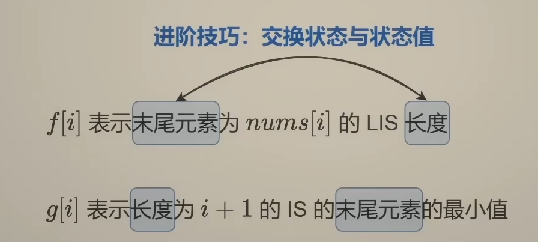

# 动态规划

## 从回溯到记忆化搜索到递推（2026-1-11）

基础题目：198.打家劫舍

扩展题目：70.爬楼梯、746.使用最小花费爬楼梯、3693.爬楼梯Ⅱ、213.打家劫舍Ⅱ

### 概述

什么是动态规划？从回溯到记忆化搜索再到递推来探索这个  问题的答案。

从打家劫舍的例子中体会这个逐步递进的过程：首先从最后一个元素开始枚举（方便后面衔接动态规划），有选或不选两个选择，`dfs（i）`表示前 i 个元素的最大金额，则 `dfs（i） = Math.max(dfs(i - 1), dfs(i - 2) + nums[i])` 。但是这样会有大量重复计算，如图 `dfs(2)`计算了两次，`dfs(1)`计算了三次


记忆化搜索：优化回溯的计算过程，将之前计算过的返回值 dfs(i) 保存，每次递归计算前判断之前是否计算过，计算过直接返回结果。

```java
private int dfs(int i, int[] nums, int[] cache) {
        if (i < 0) {
            return 0;
       }
        if (cache[i] != -1)
          return cache[i];
       cache[i] = Math.max(dfs(i - 1, nums, cache), dfs(i - 2, nums, cache) + nums[i]);
       return cache[i];
   }
```

递推：记忆化搜索用到了递归以及额外的空间保存 `dfs(i)` 的结果，能否对空间复杂度进行优化？答案是可以的，在递归遍历树的时候，我们清楚的知道节点 2 的返回值，也就是 `dfs(2)` 来自 `dfs(1)`与`dfs(0)`，同样`dfs(3)` 来自 `dfs(2)`与`dfs(1)`，所以可以直接从自顶向上转变为自底向上的递推，简单说，就是先计算  `dfs(1)`与`dfs(0)`，然后递推到 `dfs(2)`，以此类推计算到 `dfs(i)`，怎么理解这里的递推？其实就是 `dfs`时省略的递的过程，直接归。这样做的好处是：将递归转化为循环，避免了递归栈的额外空间开销。

从记忆化搜索到递推：

* 状态数组（dp 数组）记录 dfs 的返回结果
* 循环代替递归
* 状态数组的初始化代替递归边界条件

回过来看怎么理解递推？就是从先前的状态递推到下一个状态，当前状态不仅仅与当前元素有关，还与之前的元素有关，因为当前状态来自与之前的状态，而之前状态受之前元素的影响。以打家劫舍为例，打劫第 2 个房子后的最大金额 由 打劫第 1 个房子后的最大金额 与 打劫第 0 个房子后的最大金额决定，这就是递推公式。这个例子中由于当前状态只需要之前的两个状态，所以可以进一步将空间复杂度优化为 O（1）


### 结合具体题目

70.爬楼梯：爬到当前 i 阶的爬法，由 i-1阶的爬法 + i-2阶的爬法决定，这个就是递推公式，状态的初始化第一阶有一种爬法，第零阶也有一种爬法（或者第二阶有两种爬法），循环需要遍历 n 个状态，最终返回状态 n

746.使用最小花费爬楼梯：由题意花费 cost[i] 可以选择向上爬一或两个台阶，所以当前状态由前一个状态和前前状态决定，递推公式得到了，状态的初始化可以从 0 阶或 1 阶开始，前两个状态为 0，需要遍历 n 个状态，最终返回状态 n

3693.爬楼梯 Ⅱ：就是爬楼梯的变形，由题意一次可以跳 1、2、3 阶台阶，所以当前状态是由前三个状态决定的

213.打家劫舍 Ⅱ：同样，也是打家劫舍的变形


### 心得体会

* 动态规划体现了 dfs 中的归，省略递的过程直接归，将其转化为递推，当前状态由之前的状态决定，这就体现了动态，即状态是变化的。
* 当递推关系或者初始状态想不清楚时，可以回到回溯+记忆化搜索，再将其翻译为递推。
* 解题时，当题目中的当前状态受之前状态的影响，准确的说当前状态是在之前状态的基础上得来，就可以使用动态规划。

## 从回溯到记忆化搜索到递推巩固练习（2026-1-12）

基础题目：198.打家劫舍

扩展题目：740.删除并获得点数、2466.统计构造好字符串的方案数、377.组合总和、2266.统计打字方案数、64.最小路径和

### 概述

今天的题目是打家劫舍、爬楼梯这些基础题型的变形题，通过今天的学习对打家劫舍与爬楼梯这类题有了更深刻的体会。

### 结合具体题目

740.删除并获得点数：每次操作选择任意一个 nums[i] 将它与所有nums[i]+-1一同删除，并获得 nums[i]的点数，返回最大点数。这道题是打家劫舍的变形：考虑将所有值相同的 nums[i] 归为一类，也就是创建一个值域数组 sums，sums[j] 表示在 nums 中所有值 j 的数的和，例如 nums = [2,2,3,3,3,4], sums=[0,0,4,9,4]，现在就相当于在 sums 中选择一个元素，相邻元素就不能选择了，转化为了打家劫舍。

2466.统计构造好字符串的方案数：这道题其实是爬楼梯的变形题，每次可以爬 zero 或 one 阶，求爬 low 到 high 阶楼梯的方案总数

377.组合总和Ⅳ：给你一个由不同整数组成的数组 nums ，和一个目标整数 target 。请你从 nums 中找出并返回总和为 target 的元素组合的个数（不同顺序算不同的组合）。本质也是爬楼梯，相当于爬 target 阶，每次可以上 nums[i] 阶楼梯，求方案数。

2266.统计打字方案数：题目较为复杂，就不叙述了，可以在 leetcode 上参考原题。本质上是分组+爬楼梯，按照不同 target 分组，最后的方案数是各组的方案数相乘。

 64.最小路径和：这道题不是变形题，它是动归经典题型，当前状态取决于左状态与上状态。

### 心得体会

打家劫舍本质在于约束条件是选了一个元素，其相邻元素都不可以选了。 740.删除并获得节点数，选择一个节点，删除该节点值相邻的元素，所以联想到打家劫舍，没有打家劫舍的条件，就构造打家劫舍的条件：值域数组。

爬楼梯的本质是一个排列问题，也就是顺序不同属于不同的方案，例如先迈1步再迈2步与先迈2步再迈1步是不同的，这让爬楼梯适配很多题型：字符串长度一定、和一定，这种定值可以看作目标台阶数量 target，而每次可以选择不同数量的元素来构造答案，相当于一次可以选择爬不同数量的阶梯数。

## DP 模型：0-1背包与完全背包（2026-1-13）

基础题目：494.目标和、322.零钱兑换

扩展题目：2915.和为目标值的最长子序列的长度

### 概述

0-1背包与完全背包是枚举输入元素选或不选的代表。

**0-1 背包**：有 n 个物品，第 i 个物品的体积为 w[i]，价值为 v[i]，每个物品最多选一个，求体积和不超过 capacity 时的最大价值和。

#### 回溯三问

* 当前操作：枚举第 i 个物品选或不选：不选，剩余容量不变；选，容量减少 w[i]
* 子问题：剩余容量为 c 时，前 i 个物品中的最大价值和
* 下一个子问题：分类讨论：
  * 当前操作不选：剩余容量 c 从前 i-1 个物品中得到的最大价值
  * 当前操作选：剩余容量 c - w[i] 从前 i-1 个物品得到的最大价值

```java
int dfs(int i, int c, int[] w, int[]v){
	if(i<0)
        return 0;
    if(w[i] > c)
        dfs(i-1,c,w,v);  // 容量不够，不能选当前元素
    return Math.max(dfs(i-1,c,w,v),dfs(i-1,c-w[i],w,v)+v[i]);
}
```

**完全背包**：有 n 种物品，第 i 种物品的体积为 w[i]，价值为 v[i]，每种物品可以重复选，求体积和不超过 capacity 时的最大价值和。

就是 0-1 背包下添加了可以重复选物品条件，体现在递归时，选了当前第 i 种物品，还可以选第 i 种物品：如表达式1：`dfs(i,c) = Math.max(dfs(i-1,c), dfs(i,c-w[i])+v[i]);` 

> 为什么不需要写 *dfs*(*i*−1,*c*−*coins*[*i*]) 呢？选了一个就不再选了，这样不行吗？
>
> 其实表达式 1 已经考虑这种情况了，先「选一个」，递归到 dfs(i,c−w[i])，在这个递归中再「不选」，就能递归到 dfs(i−1,c−coins[i]) 了。也就是说，递归两次，我们就能表达出「选了一个就不再选」的逻辑。从这个例子，体会递归所蕴含的强大表达能力。

#### 常见变形

* 至多装 capacity，求方案数/最大价值和
* 恰好装 capacity，求方案数/最小价值和/最大价值和
* 至少装 capacity，求方案数/最小价值和

### 结合具体题目

494.目标和：这道题可以转化为恰好为 target，求方案数的 0-1背包模型。这是我的解题步骤：首先用回溯+记忆化搜索解决了题目，再翻译为递推，再进一步优化空间复杂度。

* 枚举每个数，都有选或不选
* 子问题 i 以前的元素和为 target 的方案数
* 下一个子问题：dfs(i,t) =  dfs(i,t-nums[i]) + (dfs,t)

对于当前元素，选是有条件的，必须剩余容量要大于当前物品的体积，具体而言也就是 target 要大于当前数的数值。

322.零钱兑换：这道题是完全背包的的恰好为 capacity 求最小价值的变形。amount 对应 capacity，每个硬币的价值视为1，数组 coins[i] 则对应物品体积。

2915.和为目标值的最长子序列的长度：这道题则是0-1背包的恰好为 target 求最大价值和的变形。每个数组元素对应的价值为1，nums[i] 对应物品的体积

### 心得体会

做了这几道题下来，我感觉到 DP 题目的关键在状态数组的转移方程以及状态数组的初始化，而要想写出这两个东西，要理解状态数组的含义即 `dp[i][j]` 表达的是什么意思。上面的三道题题，我们是从回溯的角度 `dfs(i,j)` 来体会返回值也就是归表达的含义中体会到了 `dp[i][j]`  的含义，即 `dp[i][j]` 表示前 i 个数中，和为 j 的方案数/价值和。希望后续熟练以后，可以直接写出动态规划的题解，而不是首先用回溯+记忆化搜索解决了题目，再翻译为递推，再进一步优化。

在对动态规划进行空间复杂度上的优化时，需要注意当前状态的更新用到了之前的哪些状态，这三道题都是当前状态的更新只用到了前一个状态（这对 i 来说），`dp[i + 1][j] = dp[i][j] + dp[i][j - nums[i]]` 或 `dp[i + 1][j] = Math.min(dp[i + 1][j - coins[i]] + 1, dp[i][j]);` 所以肯定可以采用覆盖的方式将`dp[n][target+1]` 优化为 `dp[2][target+1]`，更进一步还可以将二维数组优化为一维，这需要看当前状态是否依赖于没有旧的之前的状态，`dp[i][j - nums[i]]` 就是需要旧的之前的状态，而`dp[i + 1][j - coins[i]]` 则是依赖于新的之前的状态，这里的新旧是针对 i 与 i+1，而言的，总之，空间的优化属于锦上添花，如果实在想不清楚，可以忽略。

## DP 模型：0-1背包与完全背包变形题（2026-1-14）

基础题目：494.目标和、322.零钱兑换

扩展题目：416.分割等和子集、2787.将一个数字表示成幂的和的方案数、518.零钱兑换Ⅱ、279.完全平方数

### 结合具体题目

416.分割等和子集：该问题可以转化为01背包问题，分为两个和相等的子集，等价于是否存在一个子集和为总和的一半。所以 capacity = sum/2，体积为 nums，求是否存在恰好为 capacity 的方案。这道题有个小 trick，如果在递推过程中，出现了 dp[target] = true，也就是存在这样的方案，就可以直接返回 true，递推过程中没有出现，则返回 false表示不存在这样的方案。

2787.将一个数字表示成幂的和的方案数：这道题也是01背包问题，n 等价于背包容量，1^x，2^x... 是物品的体积，求恰好为 n 时的方案数

518.零钱兑换Ⅱ：完全背包的变形，基础题型零钱兑换（求最少硬币数）的变形，这道题求得是方案数，amount 等价于背包容量，coins 等价于物体体积，每个硬币的数量等价于价值为 1

279.完全平方数：n 等价于容量，平方数等价于物体体积，求体积和恰好为 n 的最少数量

### 心得体会

逐步能跳过回溯直接写动态规划数组的递推公式了，这些题本质上都是选与不选结合求和，比较好理解`dp[i][j]` 的含义。

完全背包与01背包还是很好区分的，只用看选过的元素能否再选即可。

## 线性 DP （2016-1-15）

基础题目：1143.最长公共子序列、72.编辑距离

扩展题目：583.两个字符串的删除操作

### 概述

怎么理解这个线性DP？可以从三个角度来理解：

* 当前状态是由过去递推过来的
* 最终可以优化为一维数组
* 从一维数组来看遍历顺序也是线性的（二维数组的遍历顺序也是线性的，先固定一个维度，再一次遍历）

所以 **01背包** 与 **完全背包** 模型都属于线性 DP，思考：它们与今天的题型有什么不同，又有什么相同？

### 结合具体题目

1143.最长公共子序列：考虑枚举两个字符串，i、j 分别表示第 i、j 个字符，回溯思想：

* 当前操作：i、j 选还是不选（也就是是否加入公共子序列当中）
* 子问题：前 i、j 个字符的最长公共子序列
* 下一个子问题：前 i-1、j-1 个字符的最长公共子序列

注意这里返回值的含义（与后面 dp 数组的含义相关）：dfs(i,j) 表示前 i 个字符与前 j 个字符的最长公共子序列。从递推的角度，两个字符串都从 0 开始枚举，`dp[i][j]` 表示前 i 个字符与前 j 个字符的最长公共子序列，对于当前状态，如果当前枚举的字符相等，自然子序列长度 + 1；如果不等，那么当前状态应该来自于前面状态的最大值，即 `max(dp[i-1][j],dp[i][j-1])`。

72.编辑距离：怎么把这道题与1143联系起来？都是对两个字符串操作，将word1转换成word2，也可以理解为相同的部分不变，不同的部分删除、替换、插入。考虑删除、替换、插入操作是对枚举的 i 字符进行操作，删除就对应 i-1，插入的话对应 j-1，替换就是 i、j 同时减一，比较抽象，需要理解，建立联系后就比较简单了。

583.两个字符串的删除操作：这道题就是编辑距离的特殊情况，只能进行删除操作，但是可以对两个字符串进行删除操作，理解了编辑距离，就很好解决这道题了。

### 心得体会

背包问题与今天的题目主要区别在于背包问题输入的是数组，今天的公共子序列系列问题输入的是字符串，dp 数组的含义也不同，背包问题 `dp[i][j]` 表示前 i 个数中和为 j 的方案数/价值和；字符串问题的 `dp[i][j]` 表示前 i 个字符与 前 j 个字符的公共子序列/变为相同的操作数。今天的题目有一个共同点就是判断当前字符是否相同，相同与不相同的操作不同。

总之今天做了字符串相关的线性 DP 问题，明天继续巩固。

## 双序列线性 DP （2016-1-16）

基础题目：1143.最长公共子序列、72.编辑距离

扩展题目：712.两个字符串的最小ASCII删除和、97.交错字符串、1458.两个子序列的最大点积、1092.最短公共超序列

### 结合具体题目

712.两个字符串的最小ASCII删除和：就是删除操作，只不过每次删除后加上 ASCII 的值

97.交错字符串：这道题首先用了暴力枚举 s3 的每个字符 i 以及 s1、s2 的每个字符 k、l，i = k，就k--；i = l 就 l -- 否则返回 false，由于有三个状态，就没能转化为递推。忽略了满足交错字符串的条件下，字符串 1 和字符串 2 的长度和一定为字符串 3 的长度，这样就可以转化为递推了。`dp[i][j]` 表示字符串 s3[0~i+j+2] 能否由 s1[0~i+1] 与 s2[0~j+1] 构成。最初我的解答的逻辑判断也可以利用 && 与 || 的性质来简化。

1458.两个子序列的最大点积：这道题我卡在了特殊情况的返回值上面，起初没有考虑选了这一组之后，不再选的情况，这是影响边界条件的，例如我选了一组数后，后续的数如果都不合法就会返回无穷大，这时这个无穷大如果与选的数的积相加，就会得到不合法的数据。所以，要允许选了一组数后，不能再选，要比较选了不在选（排除非法条件）与选了继续选的情况。

1092.最短公共超序列：这道题解题判断两个字符是否相等，相等就拼接一个答案，不相等就分别拼接各自的字符。这道题的难点在于时间复杂度与空间复杂度的优化，先得到最短公共超序列的长度，再根据这个长度来构造答案

### 心得体会

学到了一种先得到序列长度，再根据序列长度来构造答案de

## 线性DP 最长递增子序列（2026-1-17、18）

基础题目：300.最长递增子序列

扩展题目：2826.将三个组排序、1964.找出到每个位置为止最长的有效障碍赛跑路线、1671.得到山型数组的最少删除次数、2111.使数组k递增的最少操作次数

### 概述

这两天的题目的特点是：有关单数组、有序序列与之前的模型都不一样：背包问题、双序列线性 DP。主要的区别在于有序子序列。

### 结合具体题目

300.最长递增子序列：从回溯到递推的O（n^2）到贪心算法+二分的O（nlogn）。

回溯：首先子序列也是子集的一种，考虑枚举元素选不选于枚举答案选哪个；枚举元素选不选，需要维护上一个选择的下标；而枚举答案选哪个（实际上是枚举答案以nums[i]结尾的LIS）只用维护当前枚举的下标，在递归中去枚举下一个下标选谁。再一比一翻译为递推，dp[i] 表示前i个数（包括i）的最长递增子序列长度。一共 n 个状态，每次计算一个状态需要 n 次，所以复杂度是 O（n^2）

贪心算法+二分：为了进一步优化时间复杂度，考虑将状态数组的状态与状态值交换。



图中的 g 数组是单调递增的，其长度就是最长递增子序列的长度，然后通过一次遍历数组中的元素，并用二分查找其在 g 中的位置，如果不存在，则添加在后面，存在则修改，最终实现 O(nlogn) 的优化。

怎么理解？LIS 的长度要尽可能的大，而长度要增加，就要大于之前长度的末尾元素，所以维护在一定长度下遍历过程中产生的 LIS 的末尾元素最小值，这样如果当前元素的值比它大，就可以自然的加入，同时长度+1；实现时表现为二分查找g中该元素的比最后一个元素大，返回的下标恰好等于 `g.size()` 这时将该元素添加在 g 中。如果比它的小，就要更新g来维护末尾元素最小值：`g.set(j,x)`，怎么理解这里的 `g.set(j,x)`，g 是有序的，g中元素`g[i]`表示长度为i+1的 IS 的末尾元素最小值，二分查找到的元素大于等于 x，所以可以替换该位置，因为维护的是最小值。

2826.将三个组排序：问题转化为求非递减子序列的最大长度 len，nums.length - len  即为答案所需的操作数最小值。非递减子序列相当于找到 x 在 g中第一个比 x 大的数。

1964.找出到每个位置为止最长的有效障碍赛跑路线：这道题就是要找到数组中每个元素结尾的最长非递减子序列

1673.得到山型数组的最少删除次数：枚举 nums[i] 作为峰顶，分别计算其左侧的最长严格递增序列，右侧的最长严格递减序列，然后 nums.length - len1 -len2 +1 即为答案。这道题需要注意的是峰顶两边必须有数字，所以 len1 与 len2 必须大于等于 2. 同时再计算右侧的最长严格递减序列时，倒着遍历就是计算最长严格递增序列，又转化到了 300. LIS 的计算

2111.使数组 K 递增的最少操作次数：将数组分组，求每个分组的最长非递减子序列长度，再由总长度分别减去各个分组的非递减子序列最长长度，就得到了最少操作次数。

### 心得体会

300.最长递增子序列（LIS）是这些题的基础，其他题或多或少都可以直接转化为最长递增子序列。需要注意的是：

* 求最长严格递增子序列需要二分找到大于或等于当前元素的元素位置
* 求最长不降子序列需要二分找到大于当前元素的元素位置

同时每个元素可以选择删除或者不删除，就是子序列的问题，因为只删除，不会影响其他元素的顺序。最少操作数，往往可以通过求最长子序列长度，通过总长度减去来转化。

从O（n^2）到 O（nlogn）的时间上的优化用到了贪心算法 + 二分查找，能用二分查找的原因是构造的数组是有序的。这个转化的过程有个小技巧，就是将 dp 数组的状态与状态值交换。

## 线性DP 最长递增子序列（2026-1-19）

基础题目：300.最长递增子序列

扩展题目：354.俄罗斯套娃

### 具体题目

354.俄罗斯套娃：首先我的思路是将二维数组的每个元素看作一个元素，求最长递增子序列。但是我发现题目的要求是可以改变原数组的顺序的，这就导致直接求最长递增子序列会漏解。然后我就想到对二维数组根据 w 来排序，排序后的数组再求最长递增子序列即可。但是我忽略了 w 相同的情况，w 按照升序排列，相同的 w 按照 h 降序排列，这样就不会选到同一个宽度的信封，排列后的二维数组只用关注 h ，求 h 的LIS 即可。

### 心得体会

本质上还是转化为求 LIS，实现过程中用到了数组的双关键字排序，由于数组长度最大为 10^5，所以需要通过二分查找来优化，否侧会超时

```java
// 双关键字排序：宽度升序，高度降序
Arrays.sort(envelopes, (a, b) -> {
            if (a[0] == b[0]) {
                return b[1] - a[1];
            }
            return a[0] - b[0];
        });
```

## 线性 DP 总结（2026-1-19）

从最开始的打家劫舍、爬楼梯，再到背包问题，以及后来的双序列线性DP，最后是 LIS。一共五种线性模型

### 打家劫舍

打家劫舍问题是对枚举元素选与不选的一种约束，相邻元素不能连续选择，最终求选择元素的最大和。变形题型有：循环型打家劫舍，即最后一个元素与第一个元素视为相邻，通过分第一个元素选不选的情况来讨论，将其转化为打家劫舍；删除并获得节点数，要求选择一个元素要删除数组中存在的该元素值+-1的值，同样是对元素的选与不选进行约束，联想到打家劫舍，通过构造值域数组，来构造打家劫舍的数组。

### 爬楼梯

爬楼梯是求到达 target 阶台阶的不同方案数，而每次的爬法可以有很多种。本质上是一个排列问题，每次选择的爬法不同，排列不同，方案不同。相关的变形题很多，有每种爬法对应不同的消耗，求消耗的体力最小值；也有字符串长度一定，每次可以添加不同的字符串，求有多少种；数组元素中和为 target 的组合数；分组+爬楼梯。

### 背包问题

背包问题根据能否重复选择同一物品，分为 01 背包与完全背包。

#### 常见变形

* 至多装 capacity，求方案数/最大价值和
* 恰好装 capacity，求方案数/最小价值和/最大价值和
* 至少装 capacity，求方案数/最小价值和

具体的题目，往往套上一些实际应用的条件，需要拨开这些条件，看到当前问题属于哪种背包问题。

这里学到了对动态规划空间复杂度进行优化，优化的关键点在于知道当前状态的更新需要哪些状态，需要被覆盖的状态值的话就要维护一个 pre。

### 双序列线性 DP

这类题目的特点就是对两个序列做操作，找到两个序列的一些公共部分，对公共部分做操作，比如最长公共子序列，最长公共超序列。

### 最长递增子序列（LIS）

这类题目的特点是单序列，求元素之间有序：递增、非递增、递减、非递减的子序列长度。通常考虑枚举以 i 结尾的序列的前一个数选哪个来解决。

学到了一种技巧，利用贪心算法+二分查找，将递推 O（n^2）的时间复杂度优化为 O（nlogn），这个技巧是交换 dp 数组的状态与状态值，新定义一个数组 g，严格来说由于数组 g 不存在状态覆盖的问题，不属于 DP。

## 状态机 DP （2026-1-20）

基础题目：122.买卖股票的最佳时机

变形题目：309.最佳买卖股票的时机含冷冻期、188.买卖股票的最佳时机Ⅳ、121.买卖股票的最佳时机、123.买卖股票的最佳时机Ⅲ、714.买卖股票的最佳时机含手续费

### 概述

顾名思义，状态机 DP 就是 DP 数组维护了一个当前状态，`dp[i][j]` 通常表示在前缀 `a[:i]` 在状态 j 下的最优解，j 通常很小。在今天的买卖股票的专题中，状态即为持有股票与未持有股票两个状态。

### 结合具体题目

122.买卖股票的最佳时机：每天的操作有：买入、卖出、等待；所以当天的状态由前一天的买入/卖出或等待转移过来：`dp[i][j]` 表示前 i 天在当前状态为 j 下的最大利润，如果 j=0 表示当天未持有股票，则 `dp[i][0] = max(dp[i-1][0],dp[i-1][1] + price[i])`; 同理 `dp[i][1] = max(dp[i-1][1],dp[i-1][0] - price[i])`

309.买卖股票的最佳时机含冷冻期：类似打家劫舍，如果当天的操作要进行买入，则前一天不能卖出，需要从前两天转移过来，表现为：`dp[i][1] = max(dp[i-1][1],dp[i-2][0]) - price[i]`

188.买卖股票的最佳时机Ⅳ：这道题是在122的基础上添加了最多可以交易（买入卖出算一次）k 次的限制，由于最后一天持有股票的状态是无意义的，所以在卖出股票时对 k-1，同时传递参数 k 表示当前还可以最多交易 k 次，当 k <0 表示非法状态，返回无穷小。这道题的难点在直接写递推时的数组初始化，所以考虑了从回溯到递推，通过递归边界来初始化数组。从回溯的角度也很好实现变形，例如恰好完成 k 笔交易、至少完成 k 笔交易。

> 补充一下dp数组的含义：`dp[i][k][j]` 表示在前i天，在还剩下 k 次交易持有股票/未持有股票的最大利润

121.买卖股票的最佳时机：这道题就是只有一次买卖股票的机会，从前往后遍历，维护前面的最小价格，再当前价格最大时卖出

123.买卖股票的最佳时机Ⅲ：这道题就是188，最多可以完成2笔交易

714.买卖股票的最佳时机含手续费：每笔交易需要支付一次手续费，就是在 122 的基础上，买入或者卖出时减去手续费 fee

### 心得体会

状态机的引入，将 dp 数组的维度提升了，但是由于状态通常只有几个，所以相对不复杂，只要考虑清楚当前状态只能由哪种状态转移来即可。

## 状态机 DP （2026-1-21）

拓展题目：2826.将三个组排序、2786.访问数组中的位置使分数最大、1911.最大子序列交替和

### 结合具体题目：

2826.将三个组排序：首先将问题转化为 `nums.length - 最长非递减子序列长度`，只需求最长非递减子序列长度。由于 nums 的值域很小，1、2、3，可以看作是三个状态，对应非递减子序列最后一个数分别小于 1、2、3的状态，从而将问题转化为状态机 DP。

2786.访问数组中的位置使分数最大：对于每个元素选或不选，如果当前元素的奇偶性与上一个元素相同，则必须选（这样才能使分数最大），如果当前元素的奇偶性与上一个元素不相同，才可选可不选，两者取较大值。所以递归回溯时，需要传递参数 j 表示上一个元素的奇偶性；再翻译为递推时，要注意 j 的含义是前一个元素的奇偶性，对应的递推应该是：

```java
int cur = nums[i]%2; // 当前元素的奇偶性
dp[i][cur] = dp[i+1][cur] + nums[i]; // 奇偶性相同 j == cur
dp[i][cur^1] = Math.max(dp[i+1][cur^1],dp[i+1][cur] + nums[i] - x) // 奇偶性不同 j == cur^1
```

1911.最大子序列交替和：类似的，这道题也是枚举当前元素选或者不选，同时维护 j 表示前 i 个元素构成的子序列长度是奇数还是偶，也就是奇偶状态。

### 总结

至今为止，遇到的常见状态机：股票持有与否、小值域、奇偶。本质上都是在状态的约束下，前 nums[:i] 个元素构成的答案和。
